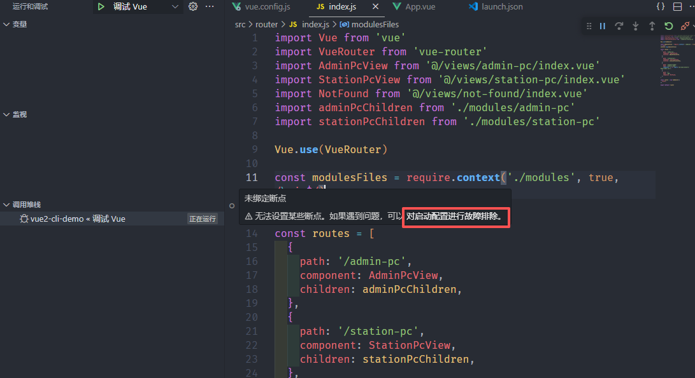
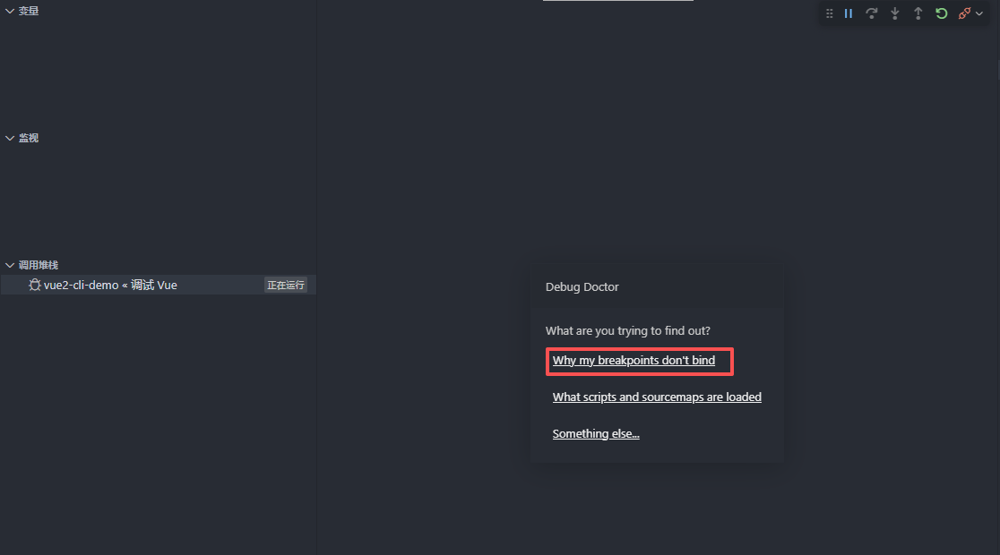

# vue2 调试模式

**package.json 文件的 name 属性值和项目文件夹名称保持一致。**

vue.config.js 配置 source-map
```js
const { defineConfig } = require('@vue/cli-service')
module.exports = defineConfig({
  transpileDependencies: true,
  configureWebpack(config) {
    config.devtool = 'source-map'
  },
})
```

launch.json 配置 sourceMapPathOverrides
```json
{
    // 使用 IntelliSense 了解相关属性。
    // 悬停以查看现有属性的描述。
    // 欲了解更多信息，请访问: https://go.microsoft.com/fwlink/?linkid=830387
    "version": "0.2.0",
    "configurations": [
        {
            "name": "Vue2 Chrome 调试模式",
            "port": 9222,
            "request": "attach",
            "type": "chrome",
            "webRoot": "${workspaceFolder}",
            "sourceMapPathOverrides": {
                "webpack://test-vue2-debug/src/*": "${workspaceFolder}/src/*"
            }
        }
    ]
}
```

js 文件调试通过 debugger 打断点，代码行左侧打断点无效。但是 debugger 之后会进入一个新页面，这个页面可以在代码左侧进行断点调试。

## 查看调试断点为什么无效？



